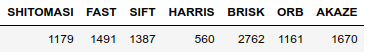
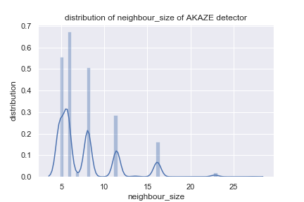
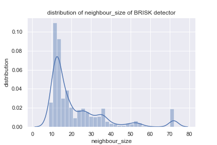
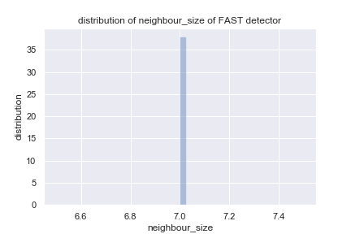
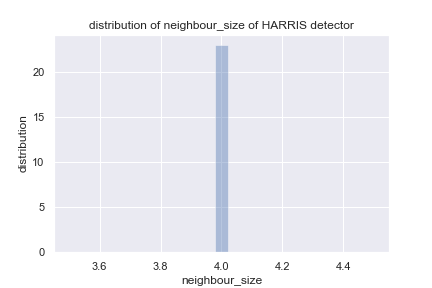
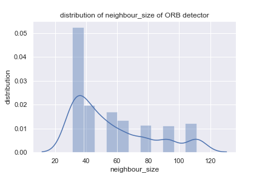
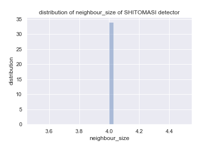
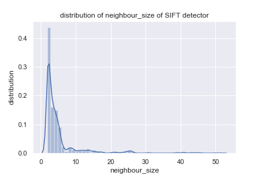
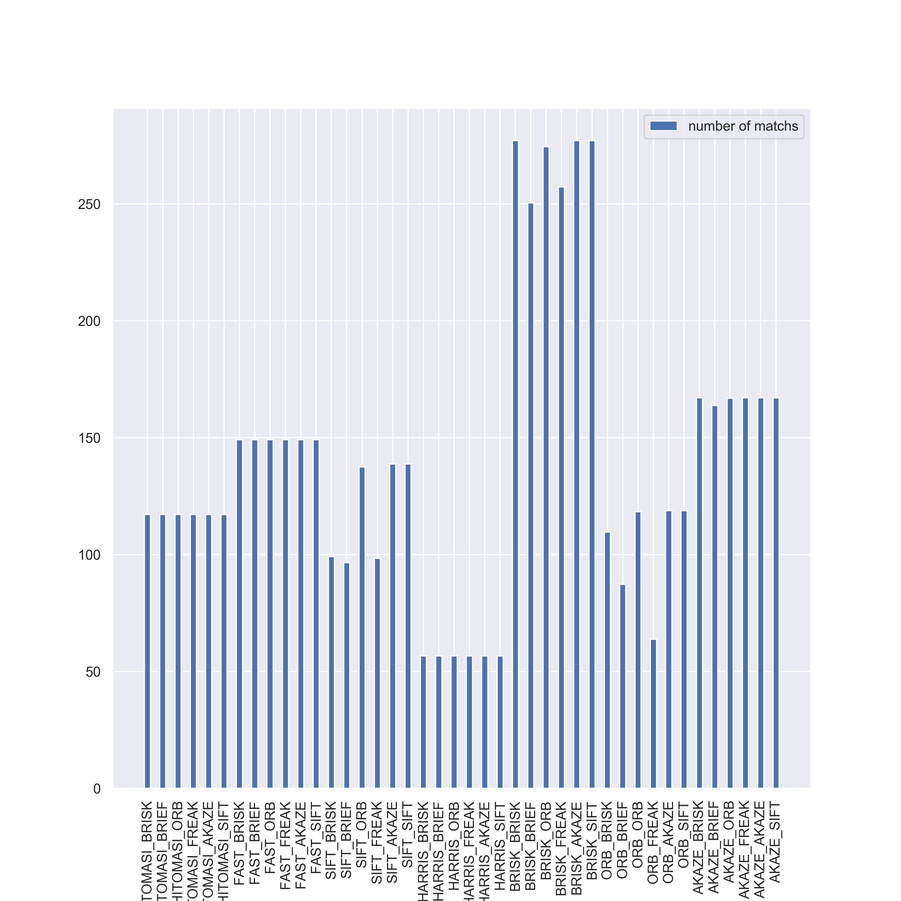
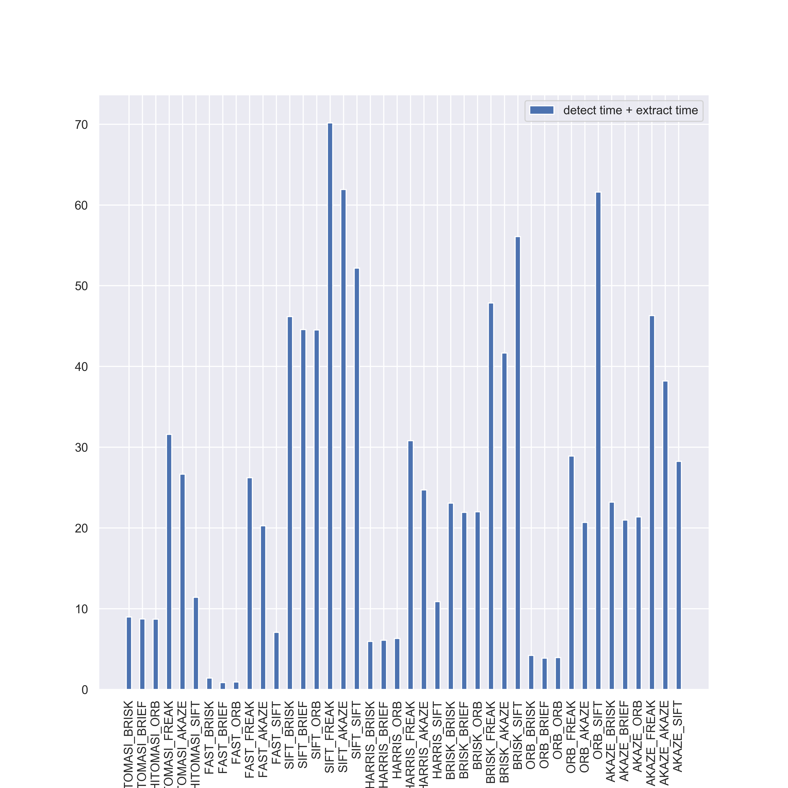

### RingBuffer
- To implement a ring buffer, we can actually use a `std::queue` or `std::dequeue`. However, those internal structure will be too complicated in our simple case (I think).
- Thus I implement a `RingBuffer` class based on a vector (`data_`), and it stores the current iterator of the vector (`currVecIt_`). You can check `ringBuffer.h`.
- When an element is pushed to the buffer, it will check whether `currVecIt_ == data_.end()`. If true, `currVecIt_` will be set to `data.end()`, and then assign the `element`. If false, the `currVecIt_` will be increment directly, and then assign the `element`.
- To support the usage of iterator of `RingBuffer` class directly, I implement also `RingBuffer::iterator`, but very limited, only several methods are implemented.

### Keypoint Detection
- Almost all of the keypoint detectors can be created by the OpenCV common interface for detectors, the HARRIS, ShiTomasi are also included.
- To create a detector, using the pattern `cv::XXXX::create()`, here I list the creators that I used in this program.
```[C++]
// for FAST
detector = cv::FastFeatureDetector::create(threshold, bNMS, type);

// for SIFT
detector = cv::xfeatures2d::SIFT::create(maxCorners, nOctaveLayers);

// for HARRIS
detector = cv::GFTTDetector::create(maxCorners, qualityLevel, minDistance, blockSize, useHarrisDetector, k);

// for BRISK
detector = cv::BRISK::create(thres, octaves, patternScale);

// for ORB
detector = cv::ORB::create();

// for AKAZE
detector = cv::AKAZE::create();
```

- the special one is the `GFTTDetector`, which actually wrappes the function `goodFeaturesToTrack`.

- To avoid the incompatible issues (some descriptors need somme special fields of their origin detectors as addtional information), I only keep the keypoints' coordinate, and set `class_id = 0`, `octave = 0` directly.


### Keypoint Removal
- To only keep the keypoint in a ROI, we can simply iterate all the keypoints, and check if they are in the ROI, here is the code.
```
vector<cv::KeyPoint> keypointsFiltered;
for(auto it=keypoints.begin(); it != keypoints.end(); it++){
    if(vehicleRect.contains(it->pt)){
        keypointsFiltered.push_back(*it);
    }
}
keypoints.swap(keypointsFiltered);
```

### Keypoint Descriptors
- Same as keypoint detectors, OpenCV proposes a common interface for descriptors (which is actually the same one, OpenCV does not distinguish them). 
- Here is the code I used
```
// for BRISK
extractor = cv::BRISK::create(threshold, octaves, patternScale);

// for BRIEF
extractor = cv::xfeatures2d::BriefDescriptorExtractor::create(bytes, useOrientation);

// for ORB
extractor = cv::ORB::create();

// for FREAK
extractor = cv::xfeatures2d::FREAK::create();

// for AKAZE
extractor = cv::AKAZE::create();

// for SIFT
extractor = cv::xfeatures2d::SIFT::create();
```

### Descriptor Matching
- FLANN
    - To create a FLANN matcher, use
    ```
    matcher = cv::DescriptorMatcher::create(cv::DescriptorMatcher::FLANNBASED);
    ```

    - However, the macher only accepts CV_32F as the input type, thus we need to convert the description into float type if it is binary. And unlike previous exercise, we need to check also the `descRef` 's type, since in the next frame, `descSource` is already converted to float in the last frame, but `descRef` is still binary. Here is the code
    ```
    if (descSource.type() != CV_32F || descRef.type() != CV_32F)
    { // OpenCV bug workaround : convert binary descriptors to floating point due to a bug in current OpenCV implementation
        descSource.convertTo(descSource, CV_32F);
        descRef.convertTo(descRef, CV_32F);
    }

    matcher = cv::DescriptorMatcher::create(cv::DescriptorMatcher::FLANNBASED);
    ```

-  k-nearest neighbor selection
    - To select the nearst 2 element, we can use 
    ```
    matcher->knnMatch(descSource, descRef, knn_matches, 2);
    ```
- The BFMatcher should be treat carefully, since for binary descriptors, we need to use hammming distance, however, for gradient based descriptors, we should use L2Norm

###  Descriptor Distance Ratio
- After the two best matches are selected, we need to determinate whether we should reject it, here the distance ratio approach is used.
```
double minDescDistRatio = 0.8;
for (auto it = knn_matches.begin(); it != knn_matches.end(); ++it)
{

    if ((*it)[0].distance < minDescDistRatio * (*it)[1].distance)
    {
        matches.push_back((*it)[0]);
    }
}
```
### Performance Evaluation 1
- To automatically process the data, I save the `neighbour_size` attribute of each keypoint into a csv file, which is speicialized for one detector.
- To generate the csv file, you can simply open the macro `PROFILE_MP7`, and then compile and run the program. The raw data (csv files) are stored in `../analyse_data/detector`.
- After saving to the csv file, I use `matplotlib` and `seaborn` to visualize the data, which you can find in `analyseData.ipynb`.
- Here is the result. The total number of keypoints can be seen below.

    

- The distribution of neighbourhood size can be seen below for each detector.

    
    
    
    
    
    
    
    

### MP.8 Performance Evaluation 2 and MP.9 Performance Evaluation 3
- Same as before, I save the matched points, detect time and extract time into a CSV file for each combination. You can reproduce this by enable the macro `PROFILE_MP8_9`.
- The raw data (csv files) are stored in `../analyse_data/combination`.
- The data processing code is also in the `analyseData.ipynb`, just below the code as before.
- Here is the result, the detector, descriptor pairs are presented in the form of `DETECTOR_DESCRIPTOR`
    - for matched points:
        
    - for time in total (detect time + descript time):
        

- You can find also the detailed time in `../analyse_data/combination/time.csv`, which is also presented in `analyseData.ipynb`.
- From above images, we can say that the (FAST + BRISK), (FAST + BRIEF), (FAST + ORB) are the best detector, descriptor pairs in automotive related application, since there are extremely fast and the performance (number of matches) are not bad (average level actually).
